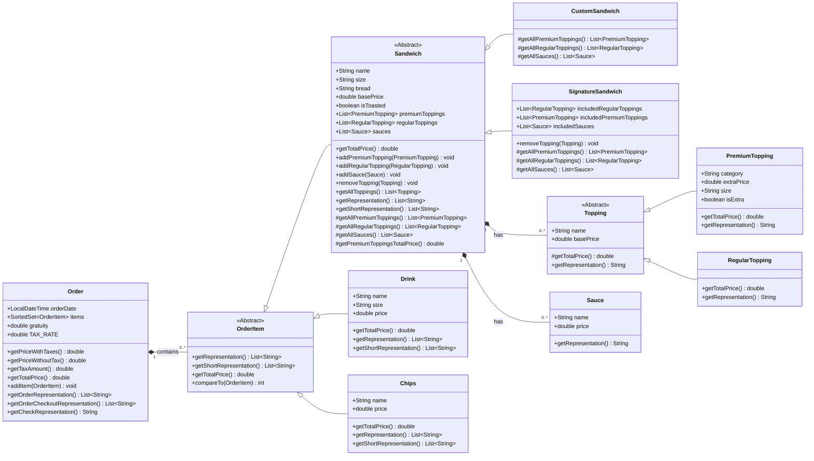
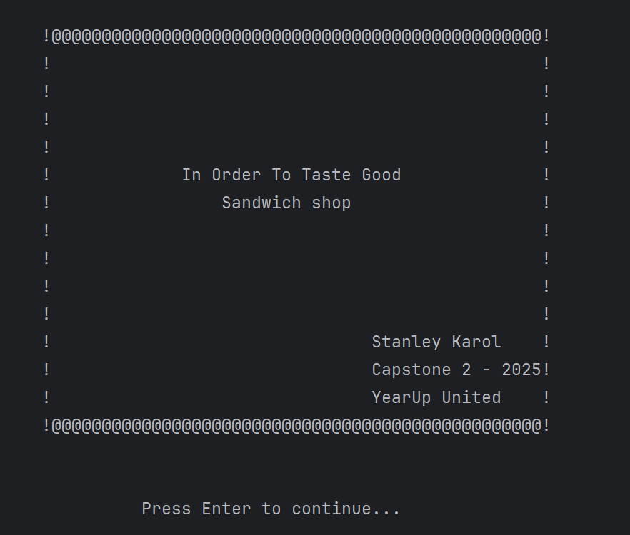
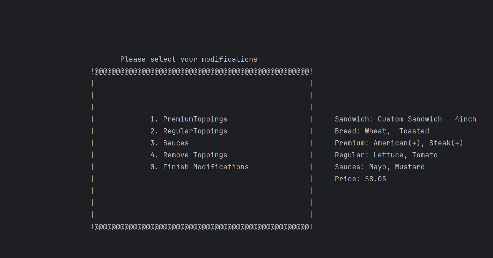
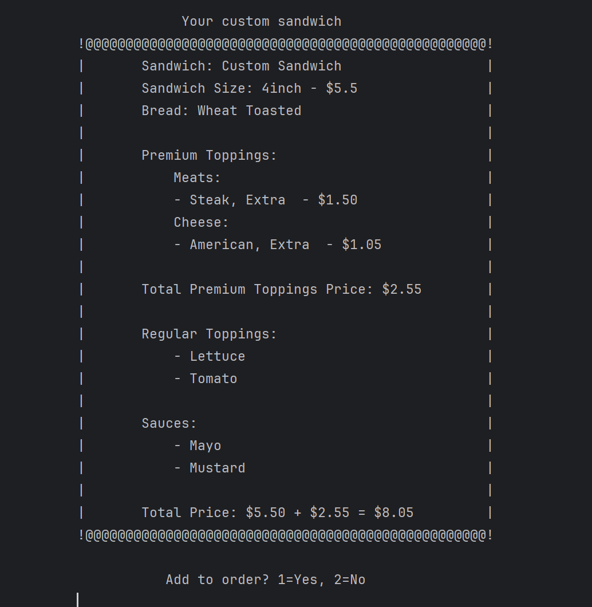
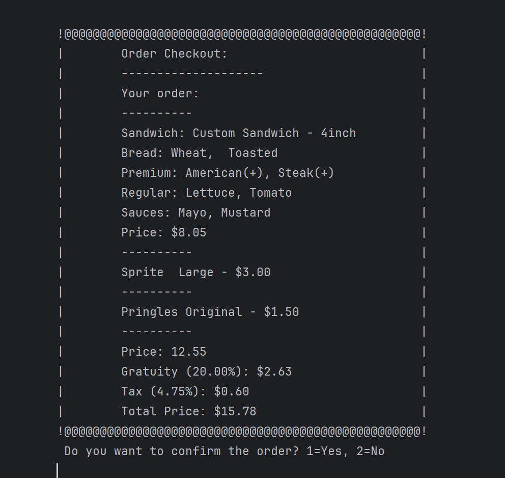

# In Order To Taste Good: Deli Sandwich Order Application

This is a console-based application written in Java that allows users to create and manage sandwich orders from a deli
menu. It provides a menu-driven interface for selecting sandwiches, toppings, drinks, and chips, and then finalizing the
order.

This project was developed as part of the YearUp Learn To Code Academy (LTCA) program (Spring 2025 cohort), with
curriculum provided by [Pluralsight](https://www.pluralsight.com/).

Guidance provided by Pluralsight instructor [Craig McKeachie](https://www.linkedin.com/in/craigmckeachie/).

## Table of Contents

- [Project Description](#project-description)
- [Features](#features)
- [How it Works](#how-it-works)
  - [Class Diagram](#class-diagram)
- [Application Screens (Console Output Examples)](#application-screens-console-output-examples)
- [Interesting Code Snippet](#interesting-code-snippet)
- [Running the Application](#running-the-application)
- [Tests](#tests)

## Project Description

This project uses Maven for dependency management and build automation.
Project Description
"In Order To Taste Good" provides a simple, menu-driven command-line interface for taking deli orders. Users can create
custom sandwiches with various bread types, meats, cheeses, and other toppings, or select from pre-defined signature
sandwiches. They can also add drinks and chips to their order. The application calculates the total cost of the order
and allows for checkout.

## Features

* **Required features:**
    * **Custom Sandwich Creation:** Users can build their own sandwiches by choosing bread, size, meats, cheeses, and
      various regular and premium toppings, as well as sauces.

    * **Drink and Chips Selection:** Users can add a variety of drinks and chips to their order.

    * **Order Management:** Allows for adding multiple items to an order and finalizing the order.

    * **Checkout Functionality:** Calculates the total price of the order and processes checkout.

    * **Receipt Generation:** Displays a detailed receipt of the order, including itemized costs and total.

* **Stretch Goals:**
    * **Signature Sandwiches:** Pre-configured sandwich options are available for quick selection.

    * **Customizable Menu:** The menu can be easily extended with new items by modifying the data/menu.json file.

    * **Unit Tests:** Basic unit tests for critical components to ensure reliability.

    * **Console Interface:** User-friendly menu system for navigation and data entry.

    * **Advanced checkout options:** Allow user to enter a tip percentage and apply it to the total order cost.

    * **Running Sandwich state:** The application maintains the state of the current sandwich being built, allowing
      users to add or remove ingredients before finalizing the order.

## How it Works

The application uses a layered structure:

UI Layer `com.pluralsight.ui`: Handles console input and output, displaying menus, prompting for user input, and
displaying formatted data. Key menu screens include `HomeScreenMenu`, `OrderScreenMenu`, and `AddSandwichScreenMenu`.

Service Layer `com.pluralsight.service`: Coordinates application flow `AppCoordinator` and orchestrates actions
related to orders and sandwiches `OrderService`, `SandwichService`.

Repository Layer `com.pluralsight.repository`: Manages data access. FileMenuRepository and FileOrderRepository handle
the reading and writing of menu and order data, respectively. The menu.json file is used for menu data.

Model Layer `com.pluralsight.model`: Defines the data structures for various entities
like `Order`, `OrderItem`, `Sandwich`,
`CustomSandwich`, `SignatureSandwich`, `Drink`, `Chips`, `Menu` and etc.

### Class Diagram



Utilities `com.pluralsight.utils`: Provides helper functions for console I/O `ScreenUtils`, `ConsoleStringReader`,
`CollectionFormatter`, and file handling `FileWriterUtils`.

The application flow starts in the Main class, which calls `AppCoordinator.start()`. The AppCoordinator then manages the
different screens and user interactions, using a menu-driven approach where user options trigger specific actions.

```bash
InOrderToTasteGood/
├── data/
│   └── menu.json
├── src/
│   └── main/
│       ├── java/
│       │   └── com/
│       │       └── pluralsight/
│       │           ├── Main.java
│       │           ├── model/
│       │           │   ├── extras/
│       │           │   │   ├── Chips.java
│       │           │   │   └── Drink.java
│       │           │   │
│       │           │   ├── menu/
│       │           │   │   ├── DrinkCategory.java
│       │           │   │   ├── Menu.java
│       │           │   │   └── PremiumToppingsCategory.java
│       │           │   │
│       │           │   ├── order/
│       │           │   │   ├── Order.java
│       │           │   │   └── OrderItem.java
│       │           │   │
│       │           │   └── sandwich/
│       │           │       ├── CustomSandwich.java
│       │           │       ├── PremiumTopping.java
│       │           │       ├── RegularTopping.java
│       │           │       ├── Sandwich.java
│       │           │       ├── Sauce.java
│       │           │       ├── SignatureSandwich.java
│       │           │       ├── Topping.java
│       │           │       └── UnitPrice.java
│       │           │
│       │           ├── repository/
│       │           │   ├── FileMenuRepository.java
│       │           │   ├── FileOrderRepository.java
│       │           │   ├── MenuRepository.java
│       │           │   └── OrderRepository.java
│       │           │
│       │           ├── service/
│       │           │   ├── AppCoordinator.java
│       │           │   ├── OrderService.java
│       │           │   └── SandwichService.java
│       │           │
│       │           ├── ui/
│       │           │   ├── entryexit/
│       │           │   │   ├── SeeYouScreen.java
│       │           │   │   └── WelcomeScreen.java
│       │           │   │
│       │           │   ├── forms/
│       │           │   │   ├── AddChipsScreen.java
│       │           │   │   ├── AddCustomSandwichScreen.java
│       │           │   │   ├── AddDrinkScreen.java
│       │           │   │   ├── AddModificationScreen.java
│       │           │   │   ├── AddPremiumToppingsScreen.java
│       │           │   │   ├── AddRegularToppingsScreen.java
│       │           │   │   ├── AddSaucesScreen.java
│       │           │   │   ├── AddSignatureSandwichScreen.java
│       │           │   │   ├── CheckoutScreen.java
│       │           │   │   └── RemoveToppingsScreen.java
│       │           │   │
│       │           │   └── menu/
│       │           │       ├── AddSandwichScreenMenu.java
│       │           │       ├── HomeScreenMenu.java
│       │           │       ├── MenuEntry.java
│       │           │       └── OrderScreenMenu.java
│       │           │
│       │           └── utils/
│       │               ├── console/
│       │               │   ├── CollectionFormatter.java
│       │               │   ├── ConsoleStringReader.java
│       │               │   └── ScreenUtils.java
│       │               │
│       │               └── files/
│       │                   └── FileWriterUtils.java
│       │
│       └── test/
│           └── java/
│               └── com/
│                   └── pluralsight/
│                       └── utils/
│                           └── console/
│                               └── OrderServiceTest.java
│                           └── console/
│                               ├── CollectionFormatterTest.java
│                               └── ConsoleStringReaderTest.java
│
└── pom.xml
```

## Application Screens

**1. Welcome Screen:**

**2. Custom Sandwich Modification Screen:**

**3. Sandwich Summary Screen:**

**4. Order Summary Screen:**


## Interesting Code Snippet:

```java
public abstract class OrderItem implements Comparable<OrderItem> {

    public abstract List<String> getRepresentation();

    public abstract List<String> getShortRepresentation();

    public abstract double getTotalPrice();

    private int getSortOrder() {
        if (this instanceof Sandwich) {
            return 1;
        } else if (this instanceof Drink) {
            return 2;
        } else if (this instanceof Chips) {
            return 3;
        }
        return Integer.MAX_VALUE;
    }

    @Override
    public int compareTo(OrderItem other) {
        int typeCompare = Integer.compare(this.getSortOrder(), other.getSortOrder());
        if (typeCompare == 0) {
            return Integer.compare(this.hashCode(), other.hashCode());
        }
        return typeCompare;
    }
}
```

### How it Works:

* **Abstract Base Class:** OrderItem defines a common interface for all items that can be added to an order. It declares
  three
  abstract methods `getRepresentation()`, `getShortRepresentation()`, `getTotalPrice()` that must be implemented by any
  concrete subclass like `Sandwich`, `Drink`, `Chips`. This ensures that every `OrderItem` can provide a detailed
  description, a
  short description, and its total price.

* **Defined Sort Order `getSortOrder()`:** This private helper method assigns a numerical priority to different types of
  `OrderItems`. `Sandwiches` are given the lowest number (1), followed by `Drinks` (2), and then `Chips` (3). This
  establishes a
  clear, logical order for how items should appear in an order list.

* **Custom Sorting `compareTo()`:** By implementing the `Comparable<OrderItem>` interface and overriding the compareTo
  method,
  `OrderItem` instances can be naturally sorted.

### Why is this design beneficial?

* **Polymorphism and Abstraction:** `OrderItem` acts as a powerful abstraction. It allows the Order class (and other
  parts of
  the application) to treat all items uniformly, regardless of whether they are a sandwich, a drink, or chips. This
  simplifies order processing, display, and total price calculation, as the specific logic for each item type is
  encapsulated within its own class.

* **Organized and User-Friendly Output:** The `compareTo` method provides a built-in, logical sorting mechanism for
  displaying
  order items. This means when a user views their order, they will see all sandwiches grouped together, then all drinks,
  and then all chips, making the order summary much clearer and easier to read.

* **Extensibility:** Adding new types of orderable items (e.g., desserts, sides) is straightforward. A new class simply
  needs
  to extend OrderItem and implement its abstract methods. If a specific display order for the new item type is desired,
  the `getSortOrder()` method can be updated. This design promotes a highly extensible and maintainable codebase.

## Running the Application

To run the application, you need to have Java and Maven installed on your machine. Follow these steps:

1. **Navigate to Project Root:**
   Clone this repository to your local machine using:
   ```bash
   cd path/to/InOrderToTasteGood
   ```
2. **Run the Application:**
   Use Maven to run the application:
   ```bash
   mvn clean compile exec:java -Dexec.mainClass="com.pluralsight.Main"
   ```

## Tests

This project uses `JUnit 5` for unit testing, managed by Maven. To run the tests, navigate to the project's root
directory where `pom.xml` is located in your terminal or command prompt and execute the following Maven command:

```bash
mvn test
```

This command will compile the test source code, run all tests defined in the src/test/java directory, and report the
results.
